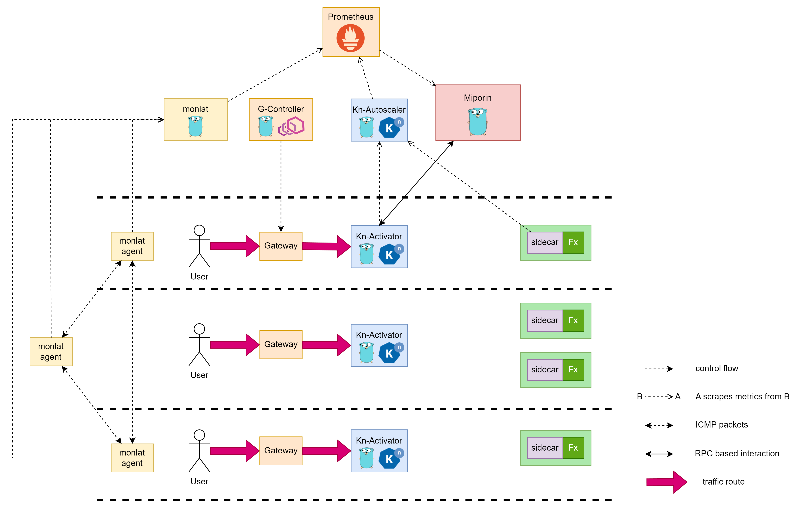

# FaaSt

[](https://www.apache.org/licenses/LICENSE-2.0)


`FaaSt` is a Knative Serving based Serverless Platform designed for Distributed System.

This repo is a copy from official repo: [ikukantai](https://github.com/bonavadeur/ikukantai.git), for publication purpose.

<p align="center">
  
</p>

## 1. Motivation

By default, **Kubernetes** and **Knative** uses "Evenly Load Balance Algorithms" in order to routing traffic to Pods/Functions. This mechanism is effective in a stable and homogeneous computing environment (like Cloud Computing). It should be noted that, "Evenly Load Balance Algorithms" in Kubernetes and Knative works with difference technology*, but the results are the same.​

If we want to use Kubernetes and Knative in Edge-Cloud, we need a more intelligent routing mechanism which take care of network latency between node, and resources in each node, and .etc.

Many related works work in deploying Knative in Edge-Cloud, but all of them are not unified-system approach. They don’t show the latency exitsts in Knative internally.

We propose an approach which improves Knative from inside. It is a Unified Serverless System for Distributed System. It is FaaSt (fast Function as a Service).

## 2. Architecture



## 3. Installation

### 3.1. System requirements

+ Three nodes are Physical Machine or VIrtual Machine, least 4 CPU and 6GB RAM each node  
+ Ubuntu-Server or Ubuntu Desktop version 20.04  
+ Kubernetes version 1.26.3  
+ Calico installed on Kubernetes cluster  
+ MetalLB installed on Kubernetes cluster

### 3.2. Install Knative Serving with Kourier is networking option

In this step we install Knative Serving's components (CRD, Knative's Pod) by applying .yaml files. Notes that the applied manifest is modified by ours, we not use the original image. We develop extra features base on [Knative-Serving](https://github.com/knative/serving/tree/release-1.12) version 1.12.1 and [Kourier](https://github.com/knative-extensions/net-kourier/tree/release-1.12) version 1.12.1

```bash
# Install CRD
kubectl apply -f manifest/1-serving-crd.yaml
# Install Knative's Pod
kubectl apply -f manifest/2-serving-core.yaml
# Install Networking Plugin
kubectl apply -f manifest/3-kourier.yaml
# Run domain config job
kubectl apply -f manifest/4-serving-default-domain.yaml
```

### 3.3. Making some changes

#### 3.3.1. Kourier Gateway

```bash
# replicate 3scale-gateway pod to 3 replicas
kubectl -n kourier-system patch deploy 3scale-kourier-gateway --patch '{"spec":{"replicas":3}}'
kubectl -n kourier-system patch deploy 3scale-kourier-gateway --patch '{"spec":{"template":{"spec":{"affinity":{"nodeAffinity":{"requiredDuringSchedulingIgnoredDuringExecution":{"nodeSelectorTerms":[{"matchExpressions":[{"key":"kubernetes.io/hostname","operator":"In","values":["node1", "node2", "node3"]}]}]}}}}}}}'
# use local gateway for every request
kubectl -n kourier-system patch service kourier --patch '{"spec":{"internalTrafficPolicy":"Local","externalTrafficPolicy":"Local"}}'
kubectl -n kourier-system patch service kourier-internal --patch '{"spec":{"internalTrafficPolicy":"Local"}}'
```

Note that fill correct nodename in your cluster into second command. Let fill all nodenames.

#### 3.3.2. Activator

```bash
# replicate activator pod to 3 replicas
kubectl -n knative-serving patch deploy activator --patch '{"spec":{"replicas":3}}'
kubectl -n knative-serving patch deploy activator --patch '{"spec":{"template":{"spec":{"affinity":{"nodeAffinity":{"requiredDuringSchedulingIgnoredDuringExecution":{"nodeSelectorTerms":[{"matchExpressions":[{"key":"kubernetes.io/hostname","operator":"In","values":["node1", "node2", "node3"]}]}]}}}}}}}'
```

Note that fill correct nodename in your cluster into second command. Let fill all nodenames.

#### 3.3.3. Check your setup

You must see **3scale-gateway** and **activator** present in all nodes, each node has one **activator** and one **3scale-gateway**

```bash
ubuntu@node1:~$ kubectl -n knative-serving get pod -o wide | grep activator
activator-5cd6cb5f45-5nnnb                1/1     Running     0                156m   10.233.75.29     node2   <none>           <none>
activator-5cd6cb5f45-fkp2r                1/1     Running     0                156m   10.233.102.181   node1   <none>           <none>
activator-5cd6cb5f45-j6bqq                1/1     Running     0                156m   10.233.71.47     node3   <none>           <none>

ubuntu@node1:~$ kubectl -n kourier-system get pod -o wide
NAME                                     READY   STATUS    RESTARTS         AGE    IP               NODE    NOMINATED NODE   READINESS GATES
3scale-kourier-gateway-864554589-5dgxl   1/1     Running   11 (5h26m ago)   2d5h   10.233.75.28     node2   <none>           <none>
3scale-kourier-gateway-864554589-btfqf   1/1     Running   12 (5h21m ago)   2d5h   10.233.71.29     node3   <none>           <none>
3scale-kourier-gateway-864554589-p7q56   1/1     Running   13 (5h29m ago)   2d5h   10.233.102.176   node1   <none>           <none>
```

### 3.4. Install our extra controller

```bash
# Install extra controller
ubuntu@node1:~$ kubectl apply -f manifest/extra-controller/configmap.yaml
ubuntu@node1:~$ kubectl apply -f manifest/extra-controller/rbac.yaml
ubuntu@node1:~$ kubectl apply -f manifest/extra-controller/extra-controller.yaml

ubuntu@node1:~$ kubectl -n knative-serving get pod | grep miporin
miporin-597dcddbc-qvlc6                   1/1     Running     0                143m
```
### 3.5. Install monlat - the Latency Monitoring system

#### 3.5.1. Install Prometheus

We follow Prometheus's installation guide in [Knative's Docs](https://knative.dev/docs/serving/observability/metrics/collecting-metrics/)

Create values.yaml first

```yaml
kube-state-metrics:
  metricLabelsAllowlist:
    - pods=[*]
    - deployments=[app.kubernetes.io/name,app.kubernetes.io/component,app.kubernetes.io/instance]
prometheus:
  prometheusSpec:
    serviceMonitorSelectorNilUsesHelmValues: false
    podMonitorSelectorNilUsesHelmValues: false
grafana:
  sidecar:
    dashboards:
      enabled: true
      searchNamespace: ALL
```

Then install Prometheus

```bash
$ helm repo add prometheus-community https://prometheus-community.github.io/helm-charts
$ helm repo update
$ helm install prometheus prometheus-community/kube-prometheus-stack -n default -f values.yaml

$ kubectl apply -f https://raw.githubusercontent.com/knative-extensions/monitoring/main/grafana/dashboards.yaml

$ kubectl create namespace metrics
$ kubectl apply -f https://raw.githubusercontent.com/knative/docs/main/docs/serving/observability/metrics/collector.yaml
```

#### 3.5.2. Install monlat

We develop a Latency Monitoring system, for more detail and installation please visit [monlat](https://github.com/bonavadeur/monlat).

## 4. Experiments

### 4.1. Deploy hello-application

```bash
# install a demoapp
$ kubectl apply -f manifest/demo_app/hello.yaml
```

### 4.2. Check system operation

```bash
# check ksvc is ready
$ kubectl get ksvc,pod -o wide | grep hello
service.serving.knative.dev/hello   http://hello.default.192.168.133.2.sslip.io   hello-00001     he
llo-00001   True
pod/hello-00001-deployment-7484848464-8btwr                  2/2     Running   0                 5m4
6s   10.233.71.1       node3   <none>           <none>
pod/hello-00001-deployment-7484848464-dlsh5                  2/2     Running   0                 5m5
0s   10.233.102.184    node1   <none>           <none>
pod/hello-00001-deployment-7484848464-vpbxg                  2/2     Running   0                 5m4
7s   10.233.75.7       node2   <none>           <none>
# curl to app
$ curl hello.default.svc.cluster.local
Konnichiwa from hello-00001-deployment-7484848464-dlsh5 in node1
```

### 4.3. Perform your experiments

## 5. Contributor

Đào Hiệp - Bonavadeur

The Future Internet Laboratory, Room E711, C7 Building, Hanoi University of Science and Technology, Vietnam.

This repo is a copy from official repo: [ikukantai](https://github.com/bonavadeur/ikukantai.git), for publication purpose.
