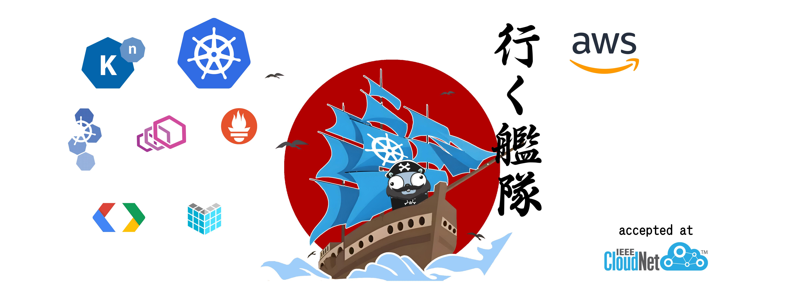
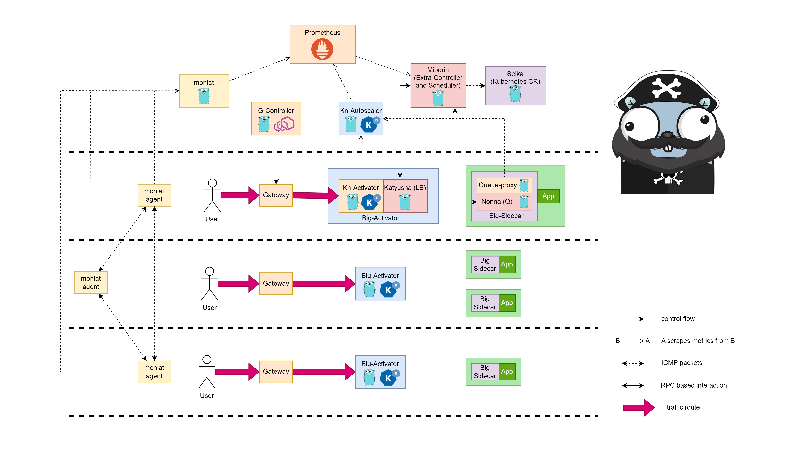

# ikukantai - 行く艦隊

### (The Iku Fleet - Hạm Đội Ikư - 行く艦隊)

[]()
[](LICENSE)
[](https://cloudnet2024.ieee-cloudnet.org)

[](https://kubernetes.io/)
[]()
[](https://knative.dev/docs/)
[](https://go.dev/)
[](https://prometheus.io/)
[](https://www.envoyproxy.io/)
[](https://aws.amazon.com/)
[](https://protobuf.dev/)


`ikukantai` is a Knative Serving based Serverless Platform designed for Distributed System.

`ANNOUNCEMENT`: **`ikukantai`'s publication has been accepted at IEEE CloudNet Conference 2024 (International Conference on Cloud Networking)**



## 1. Motivation

By default, **Kubernetes** and **Knative** uses "Evenly Load Balance Algorithms" in order to steer traffic to Pods/Functions. This mechanism is effective in a stable and homogeneous computing environment (like Cloud Computing). It should be noted that, "Evenly Load Balance Algorithms" in Kubernetes and Knative works with different algorithm, but the results are the same.​

In order to help Kubernetes and Knative operating better in Distributed System like Edge-Cloud, we developed a more intelligent routing mechanism which take care of network latency between nodes, and resources in each node, and .etc.

Many related works work in deploying Knative in Edge-Cloud, but they are not unified-system approaches. They don’t clarify the latency that exists in Knative internally.

In this project, we propose an approach that improves Knative from the inside, a Unified Serverless Platform for Distributed Systems. It is `ikukantai` (行く艦隊 - The iku Fleet - Hạm Đội Ikư - translated from Japanese).

## 2. Architecture



## 3. Installation

### 3.1. System requirements

+ Some nodes are Physical Machine or Virtual Machine, least 4 CPU and 16GB RAM for master-node and  3 CPU 6GB RAM for each worker-nodes  
+ Ubuntu-Server or Ubuntu Desktop version 20.04  
+ Kubernetes version 1.26.3  
+ Calico installed on Kubernetes cluster  
+ MetalLB installed on Kubernetes cluster (for laboratory experiments, we deploy system on a bare-metal cluster)  
+ Helm is installed

### 3.2. Install support mechanisms

#### 3.2.1. Monlat - the network latency monitoring system for Kubernetes

We develop a network latency monitoring system named `monlat`, for more detail and installation please visit [monlat](https://github.com/bonavadeur/monlat). First, let's install Prometheus Stack on Kubernetes Cluster, then install `monlat` later. The network latency metrics will be collected by Prometheus.

#### Install Prometheus Stack

We follow Prometheus Stacks installation guide from [Knative's Docs](https://knative.dev/docs/serving/observability/metrics/collecting-metrics/)

```bash
$ helm repo add prometheus-community https://prometheus-community.github.io/helm-charts
$ helm repo update
$ helm install prometheus prometheus-community/kube-prometheus-stack -n default -f manifest/prometheus/values.yaml

$ kubectl apply -f https://raw.githubusercontent.com/knative-extensions/monitoring/main/grafana/dashboards.yaml

$ kubectl create namespace metrics
$ kubectl apply -f https://raw.githubusercontent.com/knative/docs/main/docs/serving/observability/metrics/collector.yaml
```

Note: [The OpenTelemetry Collector](https://grafana.com/docs/alloy/latest/reference/components/otelcol/otelcol.exporter.logging/#:~:text=The%20OpenTelemetry%20Collector%20logging%20exporter,Collector%20repository%20in%20September%202024.) logging exporter is deprecated and removed from the upstream Collector repository in September 2024, so that you have to change all `logging` fields to `debug` using the following commands:

```bash
chmod +x ./hack/fix-otel-collector-cfg.sh
./hack/fix-otel-collector-cfg.sh
```

#### Install monlat

Follow [monlat installation guide](https://github.com/bonavadeur/monlat) to install `monlat` correctly. `monlat` is released under Apache License.

#### 3.2.2. Seika - Kubernetes Custom Resource maintains quantity of Pod in each Node

To control the ability of create and delete Function in each Node exactly, we develop a Kubernetes Custom Resource named [Seika](https://github.com/bonavadeur/seika). Seika operate like a bunch of Deployments that each Deployment control number of Pod in only one Node. By using Seika, we can create more Functions in Node that have more traffic and delete less Functions in Node that have less traffic. To install, please visit [Seika](https://github.com/bonavadeur/seika). The Seika's document includes guides for installation, usage, development. `Seika` is released under Apache License.

### 3.3. Install Knative Serving with Kourier is networking option and Our Extra-Controller

In this step we install Knative Serving's components (CRD, Knative's Pods) by applying .yaml files. Notes that the applied manifests is modified by ours, we do not use the original images and configurations. Our images are developed base on [Knative-Serving](https://github.com/knative/serving/tree/release-1.12) version 1.12.1 and [Kourier](https://github.com/knative-extensions/net-kourier/tree/release-1.12) version 1.12.1

```bash
# Install CRD
kubectl apply -f manifest/1-serving-crd.yaml
# Install Knative's Pod
kubectl apply -f manifest/2-serving-core.yaml
# Extra configmap and RBAC
kubectl apply -f manifest/miporin/configmap.yaml
kubectl apply -f manifest/miporin/rbac.yaml
# Install Networking Plugin
kubectl apply -f manifest/3-kourier.yaml
# Run domain config job
kubectl apply -f manifest/4-serving-default-domain.yaml
```

Wait until job/default-domain is success

```bash
# check if default-domain job is success
kubectl -n knative-serving get job | grep default-domain
NAME             COMPLETIONS   DURATION   AGE
default-domain   1/1           13s        71s
# delete config job
kubectl delete -f manifest/4-serving-default-domain.yaml
```

Install extra-controller `miporin`

```bash
kubectl apply -f manifest/miporin/miporin.yaml
```

`miporin` is the extra-controller working alongside and is independently of Knative's controller. For more information about `miporin`, please visit [bonavadeur/miporin](https://github.com/bonavadeur/miporin). Miporin is released under Apache License.

Install correct images by version

```bash
# Replace Knative's images by Ikukantai's images
chmod +x -R hack/*
./hack/replace-image.sh
```

### 3.4. Making some changes

#### 3.4.1. Kourier Gateway

```bash
# use local 3scale-kourier-gateway pod for every request
kubectl -n kourier-system patch service kourier --patch '{"spec":{"internalTrafficPolicy":"Local","externalTrafficPolicy":"Local"}}'
kubectl -n kourier-system patch service kourier-internal --patch '{"spec":{"internalTrafficPolicy":"Local"}}'
```

### 3.5. Check your setup

You must see **3scale-kourier-gateway** and **activator** present in all nodes, each node has one **activator** and one **3scale-kourier-gateway**

```bash
$ kubectl -n knative-serving get pod -o wide | grep activator
activator-5cd6cb5f45-5nnnb                1/1     Running     0                156m   10.233.75.29     node2   <none>           <none>
activator-5cd6cb5f45-fkp2r                1/1     Running     0                156m   10.233.102.181   node1   <none>           <none>
activator-5cd6cb5f45-j6bqq                1/1     Running     0                156m   10.233.71.47     node3   <none>           <none>

$ kubectl -n kourier-system get pod -o wide
NAME                                     READY   STATUS    RESTARTS         AGE    IP               NODE    NOMINATED NODE   READINESS GATES
3scale-kourier-gateway-864554589-5dgxl   1/1     Running   11 (5h26m ago)   2d5h   10.233.75.28     node2   <none>           <none>
3scale-kourier-gateway-864554589-btfqf   1/1     Running   12 (5h21m ago)   2d5h   10.233.71.29     node3   <none>           <none>
3scale-kourier-gateway-864554589-p7q56   1/1     Running   13 (5h29m ago)   2d5h   10.233.102.176   node1   <none>           <none>

$ kubectl -n knative-serving get pod | grep miporin
miporin-597dcddbc-qvlc6                   1/1     Running     0                143m
```

## 4. Try it out

Each time you deploy a **ksvc** (in API service.serving.knative.dev), `ikukantai` will create two custom resources automatically: one Seika and one ServiceMonitor.

+ **Seika** (in API seika.batch.bonavadeur.io) is used for ability of controlling Function creation and deletion precisely in each Node
+ **ServiceMonitor** (in API servicemonitor.monitoring.coreos.com) is used for scraping metrics of each Function to Prometheus

First, apply a simple web application named *hello*. The annotation *autoscaling.knative.dev/window: "12s"* means that if there is not traffic come to system in 12s, the Function will be scaled down. Immediately after you apply *hello* Function, the first Pod created is not under your control *hello*. You need to wait until this pod deleted after 12s, the system is now under your control.

```bash
# install a demo app
$ kubectl apply -f manifest/demo/hello.yaml
Warning: Kubernetes default value is insecure, Knative may default this to secure in a future release: spec.template.spec.containers[0].securityContext.allowPrivilegeEscalation, spec.template.spec.containers[0].securityContext.capabilities, spec.template.spec.containers[0].securityContext.runAsNonRoot, spec.template.spec.containers[0].securityContext.seccompProfile
service.serving.knative.dev/hello created
```

Get all relevant resources:

```bash
$ kubectl get ksvc,pod,seika,servicemonitor | grep hello
service.serving.knative.dev/hello   http://hello.default.192.168.133.2.sslip.io   hello-00001    hello-00001   True    
pod/hello-00001-deployment-7df54dc57f-rx7xr                  2/2     Running   0               11s
seika.batch.bonavadeur.io/hello   ["node1","node2","node3"]   0-0-0/0-0-0
servicemonitor.monitoring.coreos.com/hello
```

Wait until the first Pod is deleted (after the period set by annotation autoscaling.knative.dev/window: "12s")

```bash
$ kubectl get ksvc,pod,seika,servicemonitor | grep hello
service.serving.knative.dev/hello   http://hello.default.192.168.133.2.sslip.io   hello-00001    hello-00001   True
seika.batch.bonavadeur.io/hello   ["node1","node2","node3"]   0-0-0/0-0-0
servicemonitor.monitoring.coreos.com/hello
```

Use `netem` setup latency between nodes. In this experiment, I setup latency from **node1**, **node2** to **node3** is 50ms. So, when make request from node3, a new Pod is prefer scheduled on **node3** instead of the remain nodes.

```bash
# make request from node3
root@node3:~$ curl hello.default.svc.cluster.local
Konnichiwa from hello-node3-xgvq5 in node3

# list all resources
root@node1:~$ kubectl get ksvc,pod,seika,servicemonitor | grep hello
service.serving.knative.dev/hello   http://hello.default.192.168.133.2.sslip.io   hello-00001   hello-00001   True
pod/hello-node3-xgvq5                                        2/2     Running   0               40s
seika.batch.bonavadeur.io/hello   ["node1","node2","node3"]   0-0-1/0-0-1
servicemonitor.monitoring.coreos.com/hello
```

The Scheduling Algorithm is implemented in [miporin](https://github.com/bonavadeur/miporin), package `github.com/bonavadeur/miporin/pkg/yukari`. To enable Scheduling Feature of `ikukantai` Fleet, set config `ikukantai-miporin-enable-yukari: "true"` in `configmap/config-ikukantai`, namespace `default`

## 5. `ikukantai` ecosystem

### 5.1. Support tools

The following tools support `ikukantai` Fleet operation and can work independently from `ikukantai` in any Kubernetes Cluster.

[Monlat](https://github.com/bonavadeur/monlat) - the latency monitoring system for Kubernetes

[Seika](https://github.com/bonavadeur/seika) - the Kubernetes Custom Resource that maintains quantity of Pods in each Node

### 5.2. The tanks on the Fleet

`ikukantai` is closed-source, but you can exploit all extra power by using tanks deployed on the flight deck of the Fleet. We have a plan for developing 4 extra-components that make algorithm implementation easier in the near future.

[Miporin](https://github.com/bonavadeur/miporin) - tank commander, the extra-controller working alongside and is independently of Knative's controller, written in Go

[Nonna](https://github.com/bonavadeur/nonna) - Queuing Modifier Module on the Fleet, written in Go

[Yukari](https://github.com/bonavadeur/yukari) (comming soon) - Scheduling Algorithm Implementation Module on the Fleet, written in Go

[Katyusha](https://github.com/bonavadeur/katyusha) (comming soon) - Load Balancing Algorithm Implementation Module on the Fleet, written in Go

Panzer vor!

## 6. Author

Đào Hiệp - Bonavadeur - ボナちゃん  
The Future Internet Laboratory, Room E711, C7 Building, Hanoi University of Science and Technology, Vietnam.  
未来のインターネット研究室, C7 の E ７１１、ハノイ百科大学、ベトナム。  


